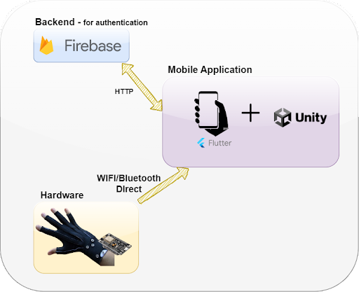
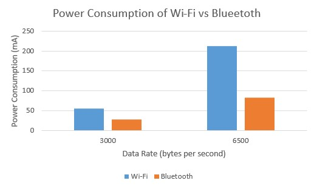
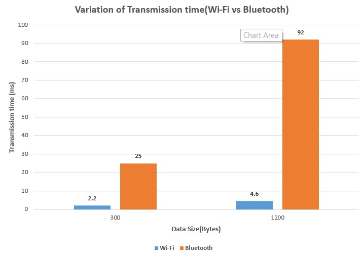
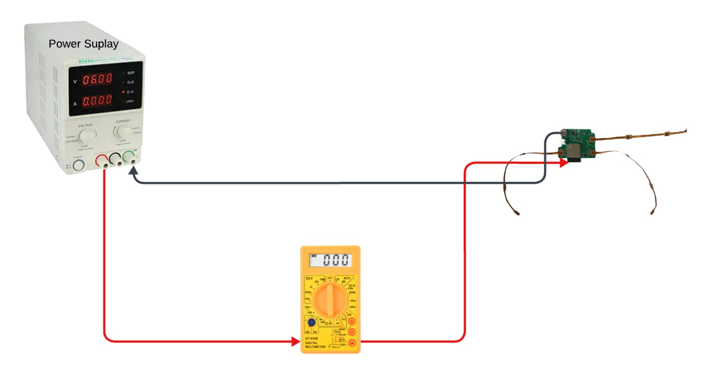
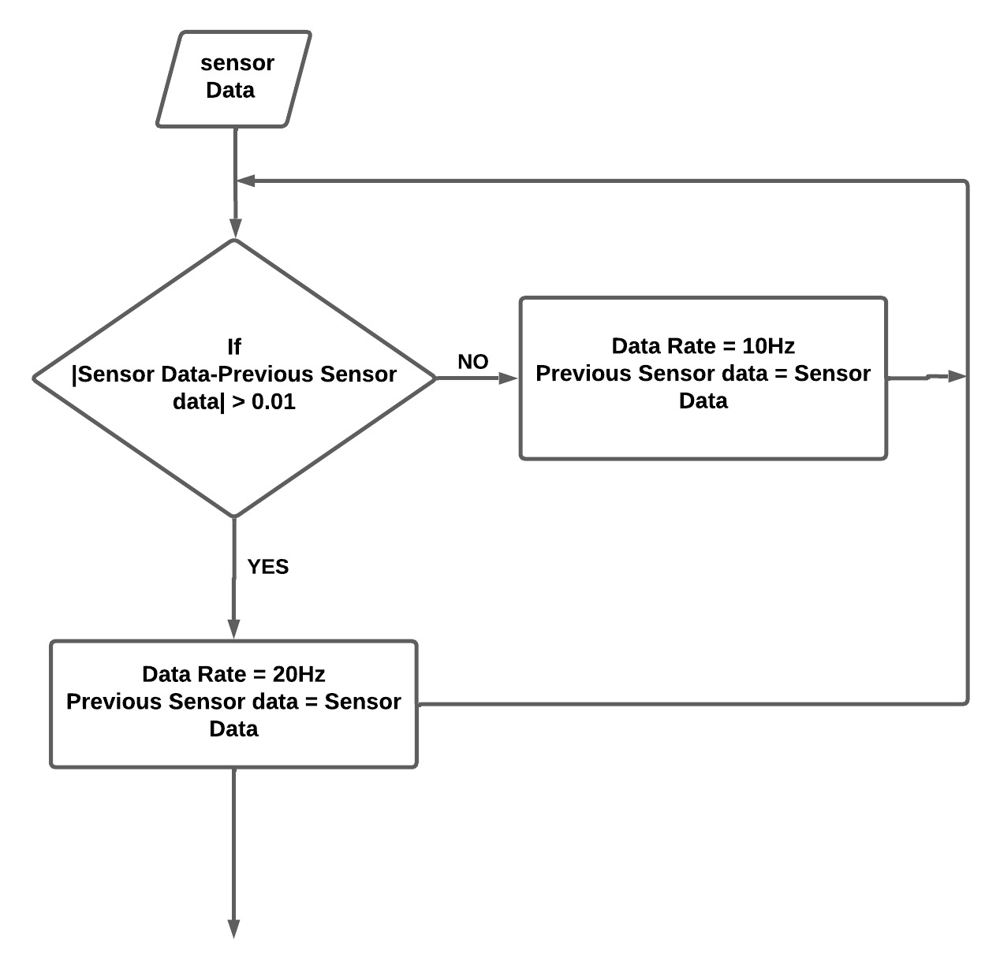
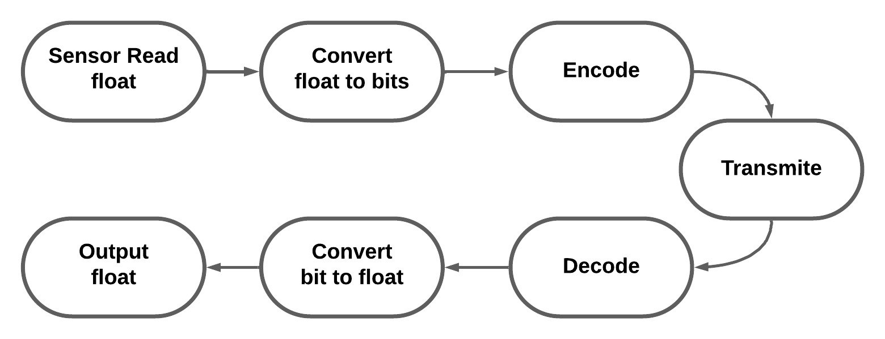

[comment]: # "This is the standard layout for the project, but you can clean this and use your own template"

# Advancing Remote Training Through a Flexible Glove for Real-Time Tracking and Analysis of Hand and Finger Movements

#### Team

- E/17/065 , Kanishka Dilhan, [e17065@eng.pdn.ac.lk](mailto:e17065@eng.pdn.ac.lk)
- E/17/212, Dananjaya Morais, [e17212@eng.pdn.ac.lk](mailto:e17212@eng.pdn.ac.lk)
- E/17/312, Ishini Udara, [e17312@eng.pdnac.lk](mailto:e17312@eng.pdnac.lk)

#### Supervisors

- Prof. Roshan Ragel, [email](mailto:name@eng.pdn.ac.lk)
- Dr. Titus Titus Jayarathna, [email](mailto:name@eng.pdn.ac.lk)

#### Table of content

1. [Abstract](#abstract)
2. [Related works](#related-works)
3. [Methodology](#methodology)
4. [Experiment Setup and Implementation](#experiment-setup-and-implementation)
5. [Results and Analysis](#results-and-analysis)
6. [Conclusion](#conclusion)
7. [Publications](#publications)
8. [Links](#links)

## Abstract

In recent years, remote training has gained significant attention as a means to bridge geographical distances and enable individuals to improve their skills remotely. However, accurately tracking, analyzing, and comparing complex hand and finger movements in real-time poses a critical challenge in remote training, as it is essential for providing precise feedback and facilitating skill development. This project focuses specifically on the application of flexible sensor gloves in surgical training.

Traditionally, assessing surgical technical skills for novice surgeons has relied on evaluations by expert surgeons. However, limitations arise when expert surgeons observe and provide feedback on the skills of novice surgeons due to the difficulty of maintaining a direct line of sight and the need for physical presence. 

To address this challenge, this research proposal aims to develop a cutting-edge solution using a flexible glove embedded with nine 9-axis Inertial Measurement Units (IMUs). The glove, equipped with sophisticated algorithms, will enable real-time capture, analysis, and wireless transmission of hand movement data to an end device. A mobile application will be used to provide real-time feedback to surgeons during training.

The outcomes of this research have the potential to transform the way training is conducted, particularly in the field of surgical skills development. By leveraging the capabilities of the flexible glove and advanced algorithms, this project aims to revolutionize remote learning by enabling individuals to reach new levels of skill and proficiency. Additionally, the technology developed in this project holds potential for applications in various fields, including music education, sports coaching, sign language detection, virtual reality gaming, and physical rehabilitation.

## Methodology

- Building firmware for hardware to acquire data
- Implementing robust algorithms to process data from the 9-axis IMUs
- Performing real-time analysis and wireless transmission of data
- Creating a user-friendly visualization using Unity
- Utilizing line graphs and scatter plots for visualizing performance metrics
- Using the charts_flutter library for visualization
- Performance comparison and classification based on the following metrics:
  - Total time spent on a particular task
  - Repeated patterns
  - Maximum/Minimum speed
  - Maximum/Minimum rotation degree
  - Smoothness
 
## Solution Architecture

## Experiment Setup and Implementation
### Flex Glove Implementation

1. Configured the Pololu USB to Serial Adapter

    Configuring the Pololu USB to Serial Adapter involves setting up the communication parameters of the adapter, such as baud rate and serial port settings. 

2. Uploaded a program to test ESP board

3. Got sensor data from 9 IMUs

    Obtaining sensor data from 9 IMUs (Inertial Measurement Units) implies collecting information from nine sets of sensors that measure accelerations, gyroscopic rates, and sometimes magnetic fields.

### Data Transmission to Mobile App
1. Dual Core Architecture
    - Use two cores
        - Core 0 - for collecting data
        - Core 1 - for Sending data

    - Use Semaphore Handle for core synchronization
  
2. Socket Server and Client
    - ESP32 WROOM acts as a socket server

    - Mobile application act as client

## Results and Analysis

#### Optimizing Data Transmission

1. Transmission Technology Selection (Wi - Fi vs Bluetooth)
When selecting the transmission technology, Focused on 
  - Data Transfer rate
  - Power Consumption

    

    Since we display movements real-time, Transmission speed is taken in to priority.
    
    

    Therefore we chose Wi-Fi as the transmission media

    This is the experimental setup used for that

    

2. Moving Average Filter

- Smooth out fluctuations in data and reduce noise.

- Reduces the overall bandwidth required for transmission.

- Allows less frequent sampling of the signal.

3. Sampling Rate Adjustment

- Lowering the sampling rate when high precision is not needed.

- Can save bandwidth.

- There are two levels of sampling rate.

-- Data sent without sampling rate adjustment - 188

-- Data sent with sampling rate adjustment - 95

4. Data Compression
 - Run Length Encoding was used

 

#### 3D Visualization

### Outcomes and Impact

1. Functioning Glove
-     Convenient for users 

2. Mobile Application
-     Realtime visualization 
         and feedback

3. Research paper
-     Optimization techniques of data transmission
-     Implementation of the flexible glove 

## Conclusion

## Publications
[//]: # "Note: Uncomment each once you uploaded the files to the repository"

 1. [Semester 7 report](./data/semester7_report.pdf)
<!-- 2. [Semester 7 slides](./) -->
<!-- 3. [Semester 8 report](./) -->
<!-- 4. [Semester 8 slides](./) -->
<!-- 5. Author 1, Author 2 and Author 3 "Research paper title" (2021). [PDF](./). -->

## Links

[//]: # ( NOTE: EDIT THIS LINKS WITH YOUR REPO DETAILS )

- [Project Repository](https://github.com/cepdnaclk/e17-4yp-flexible-glove-for-real-time-tracking-and-analysis-of-hand-and-finger-movements)
- [Project Page](https://cepdnaclk.github.io/e17-4yp-flexible-glove-for-real-time-tracking-and-analysis-of-hand-and-finger-movements/)
- [Department of Computer Engineering](http://www.ce.pdn.ac.lk/)
- [University of Peradeniya](https://eng.pdn.ac.lk/)

[//]: # "Please refer this to learn more about Markdown syntax"
[//]: # "https://github.com/adam-p/markdown-here/wiki/Markdown-Cheatsheet"
